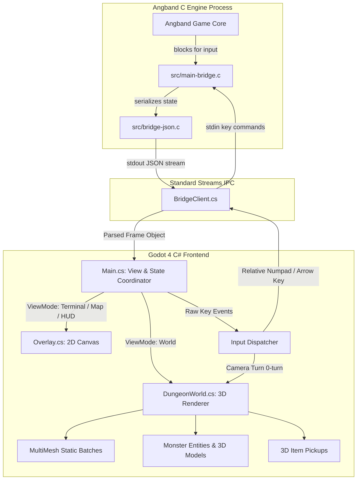

# Architecture

## Why a front end and not a rewrite

Angband has roughly thirty years of content and balance in it: hundreds of
monsters, a thousand item kinds, artifacts, curses, ego items, level feelings,
vaults. Reimplementing those rules faithfully is a multi-year project, and the
result would be a worse Angband.

Angband already separates game logic from display, ships a documented skeleton
front end (`src/main-xxx.c`), and has a headless one (`src/main-test.c`). Adding
a front end is a supported extension point. So we add one that speaks JSON, and
spend all our effort on the 3D client instead.

Alternatives considered and rejected:

- **Reimplement the rules in C#.** Years of work to reach parity.
- **Parse Angband's data files, write our own rules engine.** Still years; the
  data files describe content, not behaviour.
- **Screen-scrape the ASCII output.** Loses all semantics; no way to know what a
  glyph *is*.

## Repository layout

```
engine/          Angband fork, branch `bridge`, based on tag 4.2.6
  src/main-bridge.c    the front end
  src/bridge-json.c    JSON writer
  src/bridge-json.h
  src/cmake/macros/BRIDGE_Frontend.cmake
client/          Godot 4 client
tools/           build scripts, reference client, tests
docs/            protocol and architecture
```

`engine/` is a fork with its own history and an `upstream` remote pointing at
angband/angband. It is deliberately not committed to the parent repository; once
the fork is published it becomes a submodule.

## Keeping the fork rebasable

This is the single most important constraint in the project. A fork that cannot
take upstream updates is a dead end, and Angband is actively maintained.

All bridge code lives in **new files**. Exactly four existing files are touched,
and only to register the front end the same way every other front end is
registered:

| file | change |
|---|---|
| `src/main.h` | declare `init_bridge` and `help_bridge` |
| `src/main.c` | one entry in the `modules[]` table |
| `CMakeLists.txt` | mirror the four `SUPPORT_TEST_FRONTEND` blocks |
| `src/Makefile.src` | `BRIDGEMAINFILES`, added to `ALLMAINFILES` |

None of these touch game logic, so upstream changes almost never conflict.

Where the bridge needs behaviour that `main.c` does not provide, it does the
work itself rather than patching `main.c`. For example `create_needed_dirs()` is
called from `init_bridge()` because upstream only calls it under `#ifdef UNIX`
and the Windows front end bypasses `main.c` entirely — without this, saving
fails on Windows for every `main.c`-based front end.

## Keypresses, not commands

Angband has a command queue (`cmdq_push`) that looks like the natural injection
point. It is not, for our purposes.

Enormous parts of Angband's interface are prompts driven from inside the game
logic: which item, which direction, which spell, store haggling, character
birth, wizard confirmations. Those are not expressible as queued commands. A
front end that pushed commands would have to reimplement every one of them
before the game was even playable.

Feeding `Term_keypress()` instead means the entire existing interface works
immediately and for free. The cost is that prompts arrive as text on the raw
terminal channel, which the client overlays until native panels replace them —
a deliberate, reversible trade.

## The two channels

Angband's display is a character grid, but its *state* is structured and
reachable. The bridge exposes both:

- The **structured channel** is built from `map_info()` and
  `grid_data_as_text()`, the same functions Angband's own renderer calls. That
  guarantees the client sees exactly what the game intends to show, including
  detection, hallucination and light effects, with no separate visibility logic
  to keep in sync.
- The **raw terminal channel** carries everything that only exists as text.

Over time the raw channel shrinks as native UI replaces each panel. It never has
to disappear entirely for the game to be playable.

## Frame timing

A frame is emitted only when Angband genuinely blocks for input
(`TERM_XTRA_EVENT` with the wait flag set). Non-blocking input polls return "no
event" immediately. This means one frame per decision point rather than one per
redraw, which keeps full-level serialisation affordable.

Serialising a level is a `map_info()` call per grid, roughly 12k calls on a large
level. That is fine at turn-based rates. Clients that only need the text UI can
turn it off with `map off`.

## Robustness rules

Frames can be emitted at awkward moments — during level generation, before the
player has been placed, before a character exists. Any grid-relative lookup must
therefore be guarded; `bridge_in_play()` exists for this. An unguarded read here
crashes the process and appears to the client as truncated JSON.

## System Architecture & Data Flow



## View Routing State Machine (`NeedsTerminal`)

Angband switches between different interaction contexts (dungeon exploration, character birth, inventory, store shopping, and direction/targeting prompts). The client routes these seamlessly:

| Condition in Frame | View Mode | Visual Presentation |
|---|---|---|
| `phase != "play"` | `ViewMode.Terminal` | Character creation / splash / death screens |
| `ui.overlay > 0` | `ViewMode.Terminal` | Menus, inventory, equipment, stores |
| `!ui.awaiting_command && !ui.more` | `ViewMode.Terminal` | Direction prompts, targeting, yes/no queries |
| `ui.more == true` | `ViewMode.World` | `-more-` message pauses stay in 3D with HUD prompt |
| `_mapMode == true` | `ViewMode.Map` | Full-level 2D tactical map |
| Normal dungeon play | `ViewMode.World` | First-person 3D world with HUD overlays |

## 3D Rendering & MultiMesh Batching

To render a 12,000-tile Angband dungeon floor with high performance:
1. **MultiMesh Instance Batches**: Walls, floors, ceilings, stairs, and rubble are grouped into contiguous `MultiMeshInstance3D` nodes by material.
2. **Procedural PBR Textures**: High-resolution stone block masonry, chisel bevels, flagstone floors, and normal maps are generated procedurally on startup with zero texture file dependencies.
3. **Orientation-Aware Portals**: Door frames detect wall configurations and orient themselves along North-South or East-West corridor paths with accurate open, closed, and broken states.
4. **Dynamic Entity Tracking**: Visible monsters and items are tracked across frames with `MonsterEntity` instances, interpolating position and orientation smoothly while playing character walk/idle animations.

## Licensing and content

The project is GPL v2, inherited from Angband. That permits commercial use and
donations.

Angband's *content*, however, is heavily Tolkien-derived — Morgoth, Sauron, the
artifacts, much of the bestiary. Angband is untroubled as a free non-commercial
project. Distributing this in a form that accepts money is a different risk.
profile.

The mitigation is cheap and lives in the data files: `engine/lib/gamedata/`
contains monsters, artifacts and objects as editable text. Renaming the
Tolkien-specific content is a content edit, not a code change, and other Angband
variants have precedent for it. Do that before any release that accepts money.

Art and audio assets carry their own licences, tracked in
`client/assets/CREDITS.md`. Only CC0 or equivalently permissive sources are used.
