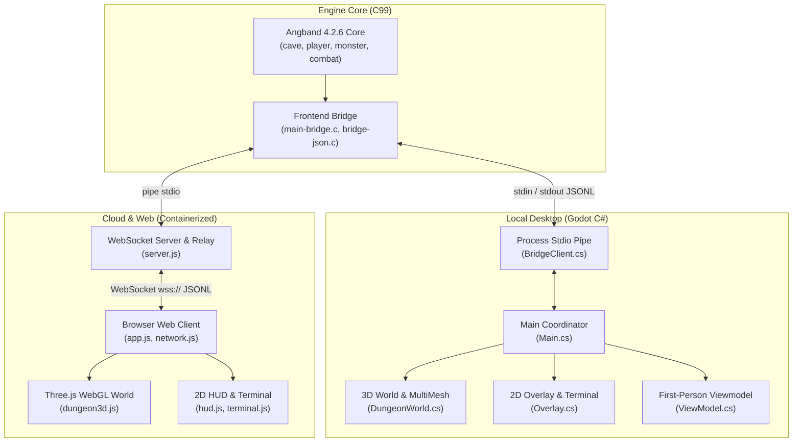

# Angband3D — System Design, Architecture & Operational Blueprint

## 1. Executive Summary & Vision

**Angband3D** transforms the classic 1990s ASCII dungeon crawler *Angband 4.2.6* into an immersive, authentic 3D first-person dungeon crawler while preserving 100% of upstream game mechanics, monster AI, RNG rolls, dungeon generation algorithms, and turn-based tactical combat.

The system features two first-class, visually and mechanically identical clients powered by an authoritative Angband 4.2.6 C engine:
1. **Desktop Client**: Built in Godot 4.7.2 with C# (.NET 8), supporting native DirectX/Vulkan rendering, procedural PBR shaders, positional audio, and offline single-player gameplay.
2. **Cloud Web Client**: Built in Three.js WebGL with vanilla ES6, served from a containerized Node.js WebSocket daemon on Google Cloud Run, supporting zero-install instant browser play across any desktop or mobile device.

---

## 2. High-Level Architecture & Topology



---

## 3. Authoritative Engine & Zero-Alloc Bridge Protocol

### 3.1 Upstream Rebasability Invariant
- The core C codebase in `engine/` is an exact fork of upstream Angband 4.2.6.
- Mechanics, tables, formulas, and RNG are never modified.
- All bridge logic is strictly encapsulated in three files:
  - `engine/src/main-bridge.c`: stdin command dispatcher, event loop hook, and state serializer.
  - `engine/src/bridge-json.c`: ultra-fast, zero-heap-allocation JSON emitter writing directly to `stdout`.
  - `engine/src/bridge-json.h`: protocol constants and serialization primitives.
- Upstream patches are tracked in `engine-patch/0001-bridge-frontend.patch` via:
  ```powershell
  cd engine; git diff 4.2.6..HEAD --output=..\engine-patch\0001-bridge-frontend.patch
  ```

### 3.2 Wire Format & Streaming Contract
- Communication between the engine and clients occurs exclusively via single-line JSON strings (`JSONL`) terminated by `\n`.
- The engine operates as a turn-based request-response finite state machine:
  - **Inbound Commands**: Keystrokes (`key up`, `key down`, `key left`, `key right`, `key <char>`), queries (`frame`, `term`), or meta commands.
  - **Outbound Frames**: Complete game frame payloads (`{ "t": "frame", "seq": 142, "phase": "play", "player": {...}, "map": {...}, "term": {...} }`).
- **Safe State Querying Rules**:
  - `slot_by_name()` must **never** be invoked on optional equipment slots (it triggers engine assertion crashes). Equipment inspection must use `bridge_get_equipped_by_type(player, EQUIP_*)`.
  - Coordinate inspections must be guarded by `bridge_in_play()` to prevent reading uninitialized dungeon grids during level generation.

---

## 4. 3D World Geometry & Spatial Invariants

### 4.1 Coordinate Space & Transformations
- **Angband Grid**: Discrete 2D integer coordinates `(x, y)` where `x ∈ [0, w-1]`, `y ∈ [0, h-1]`.
  - `x` increases East (+X).
  - `y` increases South (+Z).
- **3D World Space**:
  - Grid cell size: $2.0\text{m} \times 2.0\text{m}$.
  - World position: $X = x \times 2.0$, $Z = y \times 2.0$.
  - Wall height: $3.0\text{m}$.
  - Base eye height: $1.62\text{m}$ (human baseline), dynamically scaled between $0.70\text{m}$ (Yeek/Halfling) and $2.25\text{m}$ (Half-Troll) based on character race and physical height.

### 4.2 Camera Euler Rotation Order (`YXZ`)
To accommodate physical character heights, camera pitch tilts slightly down for tall characters and up for short characters (`targetPitch = (1.62 - eyeHeight) * 4.0°`).
> [!IMPORTANT]
> Both Godot and Three.js cameras **must** evaluate Euler rotations in `YXZ` order:
> 1. **Yaw ($Y$)**: Rotates horizontally around the upright world vertical pole.
> 2. **Pitch ($X$)**: Tilts view up or down strictly around the camera's local horizontal pitch axis.
> 3. **Roll ($Z$)**: Locked strictly to $0$ when stationary, preventing Dutch-angle room skew in all facings.

### 4.3 Wall Sealing & Anti-Pop-In Boundary Inference
In 2D Angband, unmapped dungeon squares return `FEAT_NONE` ($0$). In a 3D first-person view, omitting these tiles would create see-through holes exposing the sky or dark void behind corridors.
- **Inference Rule**: Any grid cell with `feat === 0` bordering a known or visible walkable floor/doorway (`isWalkableOrPortal`) is automatically inferred as solid granite wall (`feat = 21`).
- **Interior Bedrock Culling**: Granite wall blocks whose 8 neighbors are all solid walls are completely buried within the mountain bedrock; their GPU instances are culled, saving up to 70% of draw calls with zero visual difference.

---

## 5. Performance & Efficiency Architecture

### 5.1 Local Client (Godot 4 C#)
- **MultiMeshInstance3D Batching**: Walls, floors, ceilings, and portals are batched into single-draw-call `MultiMeshInstance3D` nodes per terrain type.
- **Radial Horizon Culling**: Geometry updates are clamped to a radius $R \le 28$ tiles ($R \le 45$ in Town), avoiding wasteful matrix math outside the maximum fog horizon.

### 5.2 Web Client (Three.js WebGL)
- **InstancedMesh Zero-Allocation Buffering**:
  - Geometry is rendered via `THREE.InstancedMesh`.
  - Pre-allocated scratch objects (`this._scratchWallColor`, `this._scratchFloorColor`, `this._scratchCeilingColor`) eliminate heap allocations and garbage collection stutter during grid refreshes.
- **HTTP Asset Compression & Browser Caching**:
  - The Node.js server pipes text, JavaScript, CSS, and 3D models through native `zlib` gzip compression (reducing download payload by up to 80%).
  - Assets are served with `Cache-Control: public, max-age=86400, immutable` for static textures/models and `no-cache` for HTML/saves.

### 5.3 Process Lifecycle & Container Resilience
- **Isolated Process Spawning**: Each WebSocket connection spawns an independent, sandboxed Angband process with isolated stdout/stdin pipes.
- **Active Session Registry**: All live processes are tracked in an `activeSessions` Map with start timestamps and user identifiers.
- **Graceful Shutdown**: On container `SIGTERM` or `SIGINT`, all active child processes receive clean `SIGTERM` signals, flushing save files before process termination.
- **Liveness Probes**: `/healthz` endpoint reports uptime, active session counts, and engine binary status for Cloud Run autoscaling and health checking.

---

## 6. Packaging & Deployment Pipelines

### 6.1 Local Standalone Distribution (`tools/package.ps1`)
The local packaging pipeline automates release creation for Windows x64:
1. Compiles Angband C engine in Release mode.
2. Compiles Godot C# client in Release mode.
3. Invokes Godot's headless release exporter (`--export-release "Windows Desktop"`).
4. Stages `Angband3D.exe`, `Angband3D.pck`, the .NET assembly directory (`data_angband3d_windows_x86_64`), the C engine binary, and gamedata (`lib/`).
5. Generates the standalone `Angband3D-Windows-x64.zip` package.

### 6.2 Cloud Container & Cloud Run Deployment (`cloudbuild.yaml`)
1. Multi-stage Docker build:
   - **Stage 1 (Builder)**: Compiles headless C engine with bridge patch on Ubuntu 22.04.
   - **Stage 2 (Runtime)**: Minimal `node:18-slim` container hosting Node.js WebSocket daemon and static WebGL client.
2. Automated Google Cloud Build triggers push to Google Container Registry (`gcr.io/resonant-1679933304535/angband3d-cloud`).
3. Continuous deployment to Google Cloud Run with HTTP/2 and WebSocket streaming enabled.

---

## 7. Verification & Quality Assurance Suite

| Test Suite | Command | Coverage |
|---|---|---|
| Engine Bridge Smoke Tests | `python tools/smoke_test.py` | 11/11 tests: handshake, map serialization, wizard mode, save/load roundtrips, menus |
| Godot C# Compilation | `dotnet build client/angband3d.csproj` | Release and Debug build correctness, zero warnings |
| Headless Browser Automation | `node tools/test_cardinal_and_corridor.js` | Full Chrome CDP test verifying camera YXZ angles, level horizon, and death modal input |
| Packaging Validation | `powershell -File .\tools\package.ps1 -SkipZip` | Verifies standalone export, .NET runtime staging, and gamedata integrity |
